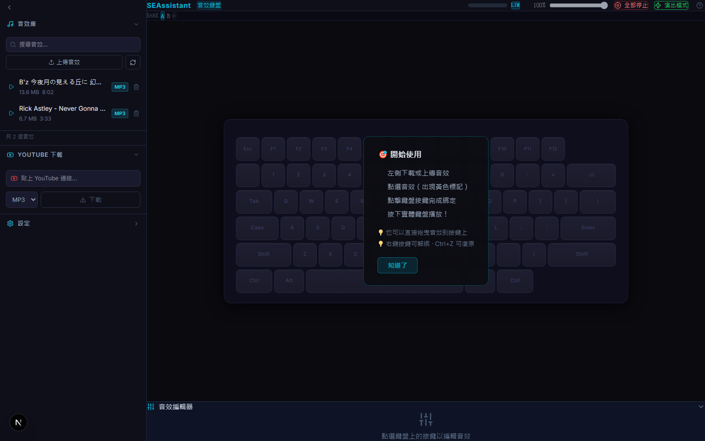

# SEAssistant — 網頁版 Soundplant

> 把電腦鍵盤變成音效觸發器。下載 YouTube 音效、綁定到按鍵、一鍵播放。專為現場演出 PA 設計。



## 功能

### 核心
- **全鍵盤綁定** — 80+ 鍵（F1-F12、數字、QWERTY、空白鍵），每鍵獨立設定
- **即時播放** — Web Audio API，低延遲（`latencyHint: interactive`）
- **YouTube 下載** — 貼 YouTube 連結，自動下載為 MP3/WAV，即時進度
- **波形剪輯** — WaveSurfer.js 波形顯示，拖拉設定播放起點/終點
- **Sound Banks** — 多頁鍵盤配置（A/B/C...），Ctrl+1~9 快速切換場景

### 播放控制
- **三種模式** — 單次（one-shot）、按住播放、切換（toggle）
- **淡入淡出** — 每鍵可設 0-2 秒漸入漸出
- **互斥群組** — 同群組按鍵互斥播放（如 hi-hat 開/關）
- **Master Volume** — 主音量推桿，即時控制總輸出
- **Master Limiter** — DynamicsCompressor 防爆音，可開關

### 演出模式
- 全螢幕鍵盤，隱藏編輯介面
- 按鍵放大（64px）+ 字體放大，暗場可讀
- 播放中綠色邊框 + 進度條，一眼辨識
- 即時時鐘（HH:MM:SS）
- Cue Log 記錄最近觸發的音效
- VU Meter 三段色即時音量表
- Input 焦點防搶，不會誤觸
- Escape 退出

### 工作流
- 自動儲存 + 啟動自動載入
- 設定匯出/匯入（JSON）
- Undo（Ctrl+Z，最多 20 步）
- 複製貼上按鍵綁定（Ctrl+C/V）
- 右鍵解綁、雙擊預聽
- 拖曳或點擊綁定音效
- 側邊欄可收合
- 快捷鍵說明（按 ?）
- 新手引導（首次使用）
- 瀏覽器關閉確認

## 快速開始

### 環境需求

- **Node.js** 18+
- **yt-dlp**（YouTube 下載用）
- **ffmpeg**（音訊轉檔 + 取得時長）

```bash
# 確認已安裝
node --version    # v18+
yt-dlp --version  # 2024+
ffmpeg -version   # 任意版本
```

### 安裝

```bash
git clone https://github.com/adbeweblink/seassistant.git
cd seassistant
npm install
```

### 啟動

```bash
npm run dev
# 開啟 http://localhost:3716
```

### 使用流程

1. **下載音效** — 左側「YouTube 下載」貼連結，或「上傳音效」選本機檔案
2. **綁定** — 點擊音效（出現黃色標記）→ 點擊鍵盤按鍵完成綁定
3. **播放** — 按下實體鍵盤對應按鍵
4. **調整** — 點選已綁定按鍵，底部編輯面板調整音量/模式/淡入淡出/播放區間
5. **演出** — 右上角「⚡ 演出模式」進入全螢幕

## 快捷鍵

| 操作 | 說明 |
|------|------|
| 點擊音效 → 點擊按鍵 | 綁定音效 |
| 拖曳音效到按鍵 | 綁定（另一種方式） |
| 雙擊已綁定按鍵 | 預聽 |
| 右鍵已綁定按鍵 | 解除綁定 |
| Ctrl + Z | 復原上一步 |
| Ctrl + C / V | 複製/貼上按鍵設定 |
| Ctrl + 1~9 | 切換 Sound Bank |
| ⚡ 演出模式按鈕 | 進入全螢幕演出 |
| Escape | 退出演出模式 |
| ? | 顯示快捷鍵說明 |

## 技術棧

| 項目 | 技術 |
|------|------|
| 框架 | Next.js 15（App Router） |
| 語言 | TypeScript |
| UI | Tailwind CSS v4 |
| 狀態 | Zustand |
| 音訊 | Web Audio API |
| 波形 | WaveSurfer.js v7 |
| 下載 | yt-dlp + ffmpeg |
| 測試 | Playwright（12 個 E2E 測試） |

## 專案結構

```
src/
├── app/                  # 頁面 + API Routes
│   ├── page.tsx          # 主頁面（一般/演出模式）
│   └── api/
│       ├── sounds/       # 音效 CRUD + 串流
│       ├── youtube/      # YouTube 下載（SSE）
│       ├── config/       # 配置存讀
│       └── folder/       # 資料夾管理
├── components/
│   ├── keyboard/         # KeyboardLayout + KeyCap
│   ├── editor/           # 波形編輯器 + 播放設定
│   ├── sidebar/          # 音效庫 + 設定面板
│   ├── youtube/          # YouTube 下載面板
│   └── ui/               # HelpOverlay
├── hooks/                # useKeyboardBinding, useAutoSave, useInitialLoad...
├── lib/                  # audio-engine, types, keyboard-map
└── store/                # Zustand store
```

## 與 Soundplant 比較

| 功能 | Soundplant | SEAssistant |
|------|:---------:|:-----------:|
| 鍵盤綁定 | ✅ | ✅ |
| 即時播放 | ✅ | ✅ |
| 播放模式 | ✅ | ✅ |
| 波形剪輯 | ✅ | ✅ |
| Sound Banks | ✅ | ✅ |
| Exclusive Groups | ✅ | ✅ |
| **Limiter 防爆音** | ❌ | ✅ |
| **演出模式** | ❌ | ✅ |
| **Cue Log** | ❌ | ✅ |
| **YouTube 下載** | ❌ | ✅ |
| **Undo** | ❌ | ✅ |
| **VU Meter** | ❌ | ✅ |
| 全域鍵盤 | ✅ | ❌（Web 限制） |
| MIDI | ✅ | ❌（未來可加） |

## 開發

```bash
npm run dev       # 開發模式（Port 3716）
npm run build     # 正式建置
npx playwright test  # 跑 E2E 測試
```

## License

MIT
